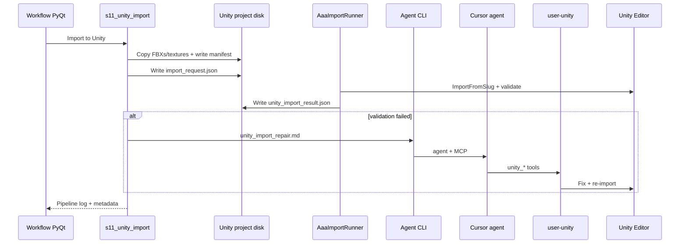

# AAA Workflow — Concept Image → Meshy → FBX → Unity MCP

A focused PyQt app for Character / Vehicle / Aircraft FBX pipelines: generate or drop an approved concept, optional Magnific uprez, run Meshy, export FBX + textures, then **deterministic Unity import** via the AAA UPM package (AnkleBreaker MCP agent **only on validation failure**).

**In scope:** Approved concept via drag-drop, Midjourney, optional Magnific/Higgsfield generate, Magnific Uprez, Meshy chain, Unity import.

**Required for 3D:** Meshy API key only. Higgsfield MCP is **optional** (still supported for **Use Higgs** / `concept_generate` testing).

**Command Center** (`launch.bat`) still provides the full prompt → concept review → Meshy path for Midjourney + multi-concept approval.

See also: [README.md](README.md) for the full AAA architecture and both GUI entry points.

---

## Quick start

```powershell
.\launch-workflow.bat
```

Or:

```powershell
.\.venv\Scripts\python.exe -m asset_assembly_automator.gui.workflow_main
```

Dry-run (no Meshy credits, fake Cursor CLI):

```powershell
.\.venv\Scripts\python.exe -m asset_assembly_automator.gui.workflow_main --dry-run
```

Entry point: `aaa-workflow` (after `pip install -e ".[dev]"`).

---

## Architecture

```mermaid
flowchart LR
    subgraph pyqt [AAA Workflow PyQt]
        CI[Concept Image Higgs/Magnific/Uprez]
        DZ[Drop zone T-pose PNG]
        BS[bootstrap pipeline Save]
        MR[Run Meshy chain]
        UI[Import to Unity button]
    end
    subgraph meshy [Meshy stages s04-s10]
        IP[Concept Image image_prep]
        I2D[i2d]
        RM[remesh]
        RG[rig]
        AN[animate]
        DL[download]
        QC[qc]
        ZIP[package_export]
    end
    subgraph unity [Unity import s11]
        ST[Stage FBXs + manifest]
        PKG[com.assetassembly.import]
        CS[C# ImportFromSlug + Validate]
        AG[Agent repair on fail]
        MCP[AnkleBreaker unity]
        ED[Unity Editor]
    end
    CI --> BS
    DZ --> BS
    BS --> MR
    MR --> IP --> I2D --> RM --> RG --> AN --> DL --> QC --> ZIP
    ZIP --> ST --> PKG --> CS --> ED
    CS -->|fail| AG --> MCP --> CS
```



### Reused from main AAA app

| Component | Purpose |
|-----------|---------|
| `Database` | Same SQLite DB (`%LOCALAPPDATA%/AssetAssemblyAutomator/aaa.db`) |
| `PipelineController` / `PipelineRunner` | Async stage execution, logging, resume |
| Meshy stages `s05`–`s10` | Full Meshy chain |
| `FakeMeshyClient` | Dry-run without API credits |
| `FakeMagnificClient` / `FakeHiggsfieldClient` | Dry-run concept generate + Uprez |
| `clients/magnific_client.py` | Magnific Mystic + upscaler REST client |
| `gui/dialogs/provider_cost_dialog.py` | Cost confirmation before paid generation |

### Workflow-specific components

| File | Purpose |
|------|---------|
| `gui/workflow_main.py` | Workflow window — Concept Image UI + Meshy + Unity |
| `gui/widgets/drop_zone.py` | Drag-and-drop T-pose entry |
| `gui/widgets/character_preview_panel.py` | T-pose + mesh preview |
| `gui/widgets/pipeline_stepper.py` | `MeshyWorkflowStepper` (Concept Image → Meshy → Unity) |
| `workflow/bootstrap.py` | Drop → pipeline + tpose seed |
| `stages/s11_unity_import.py` | Stage files + Cursor CLI trigger |
| `workflow/unity_mcp_workflow.py` | Compose import/cleanup prompts + run CLI |
| `clients/cursor_cli_client.py` | Headless `cursor-agent` wrapper |
| `config/workflows/unity_import.md` | Default Unity MCP import prompt (validated tool chain) |
| `config/workflows/unity_import_cleanup.md` | Remove-from-Unity cleanup prompt |

---

## UI walkthrough

1. **Project** — select existing project or use auto-created Default Project.
2. **Character name** — slugged for output folders; **Save** commits concept or rename.
3. **Concept Image** — edit prompt; optionally **Use Higgs** (Higgsfield MCP) or **Use Magnific**; or drag-drop / Midjourney import without either provider.
4. **Drop zone** — alternative: drag PNG/JPG/WEBP T-pose art directly.
5. **Preview** — generated, uprezzed, or dropped image; click **Save** to write `TPose/CHR_{slug}_TPose_Approved_v01.png`.
6. **Unity project** — path to Unity project root (saved on `projects.unity_project_path`).
7. **Poly budget** — hero / npc / crowd (Meshy API max 300k tris, 4K HD textures).
8. **Texture prompt** — optional Meshy texture prompt (used when `use_hires_texture_image` is false).
9. **Run Meshy** — cost confirmation, then Concept Image prep (auto-downscale if >2048px / 18MB) and full Meshy chain.
10. **Unity import prompt** — editable multiline text preloaded from `unity_import.md`.
11. **Import to Unity (Cursor MCP)** — runs `s11_unity_import`.
12. **Remove from Unity (Cursor MCP)** — cleanup prompt for re-test.

### Concept prompt template (default)

```
<character description here> full body T-pose, front view, orthographic character sheet,
symmetrical design, <head desc>, <outfit description, colors>, arms straight out horizontally,
legs slightly apart, clean silhouette, neutral expression, game-ready HD photo-realistic,
plain white background, no weapons, no props, no text, no watermark
```

Works well with Midjourney (manual), Magnific, and optional Higgsfield MCP.

### Magnific Uprez options

| Control | Values |
|---------|--------|
| Mode | Precision V2 (faithful, default) · Creative (prompt-guided) |
| Scale | 2x · 4x · 8x · 16x |
| Flavor | sublime · photo · photo_denoiser (Precision only) |

Configure defaults in `config/default.yaml` under `magnific:`.

---

## Meshy credit estimates

| Step | Credits (approx.) |
|------|-------------------|
| Image-to-3D | 5–30 (UI estimates ~15) |
| Remesh | 5 |
| Rig (walk + run included) | 5 |
| Custom animation (each) | 3 |

Default workflow skips custom animations.

---

## Output layout

### Character output (AAA)

```
{output_root}/Characters/{slug}/
  TPose/CHR_{name}_TPose_Approved_v01.png
  Source/Character_output.fbx
  Source/Animation_Walking_withSkin.fbx
  Source/Animation_Running_withSkin.fbx
  Animations/ANIM_{name}_custom_*.fbx
  Textures/base_color.png
  CHR_{name}_MeshyExport.zip
  pipeline_manifest.json
```

### Unity staging (s11)

```
{unity_project}/Assets/Characters/{slug}/
  Source/
  Textures/
  Animations/
  Materials/
  Prefabs/
  Controllers/
  unity_import_manifest.json
  .aaa/import_request.json          # C# watcher trigger
  .aaa/unity_import_result.json     # validation result
  .aaa/unity_repair_{slug}.md       # repair prompt attachment (on failure)
```

---

## Unity import model

The PyQt app **cannot** call Unity MCP directly. MCP servers in `.mcp.json` are only available to a Cursor/Claude agent.

**v0.2 happy path:** deterministic C# via `com.assetassembly.import` UPM package. **AnkleBreaker MCP (`unity` / user-unity)** runs only on validation failure, cleanup, and Diagnostics.



### Flow (step by step)

1. **s11** injects `com.assetassembly.import`, copies FBX/textures into the Unity project, and writes `unity_import_manifest.json`.
2. **s11** writes `{slug}/.aaa/import_request.json` — the C# `AaaImportRunner` picks it up in the open Editor.
3. **AaaImportRunner** calls kind-specific import (`ImportFromSlug` / vehicle / aircraft utilities), validates, and writes `unity_import_result.json`.
4. If validation fails, **s11** runs agent repair via [`config/workflows/unity_import_repair.md`](config/workflows/unity_import_repair.md) using **AnkleBreaker `unity_*` tools only**.
5. After repair, **s11** re-triggers C# import once and re-reads `unity_import_result.json`.

### Agent repair tools (AnkleBreaker)

| Step | MCP tools | Outcome |
|------|-----------|---------|
| Preflight | `unity_editor_ping`, `unity_editor_state`, `unity_console_log` | Editor reachable; not compiling |
| Fix | `unity_execute_code`, `unity_execute_menu_item` | Re-run `ImportFromSlug` or fix reported validator issues |
| Verify | `unity_asset_list`, `unity_gameobject_info`, `unity_component_get_properties` | Prefab + Animator + patrol/controller present |

Manual agent import reference (Workflow prompt editor): [`config/workflows/unity_import.md`](config/workflows/unity_import.md).

Cleanup prompt: [`config/workflows/unity_import_cleanup.md`](config/workflows/unity_import_cleanup.md) — **Remove from Unity**; uses one `unity_execute_code` returning `SUCCESS`.

### Unity project prerequisites (one-time)

| Asset | Role |
|-------|------|
| `Packages/com.assetassembly.import` | Injected UPM package — import utilities, validators, patrol/controllers |
| Open Unity 6 Editor | Required while import/repair runs |

**Required for 3D:** Meshy API key only. **Unity 6 + AnkleBreaker MCP** are **required** for `unity_import`, cleanup, and Diagnostics (see below).

### Prerequisites (host machine)

| Requirement | Notes |
|-------------|-------|
| **Unity 6 Editor** | Install via Unity Hub; keep target project **open** during import/repair |
| **AnkleBreaker Unity MCP** (default) | Server **`unity`** (Cursor: **user-unity**). Copy [`mcp.json.example`](mcp.json.example) → `.mcp.json` |
| **Coplay / Official** (fallbacks) | Set **Settings → Unity MCP bridge**; enable matching server in Cursor MCP |
| **Cursor or Claude CLI** | Agent repair + Diagnostics ping (`cursor-agent` or `claude` on PATH) |
| **Unity project path** | Set in Workflow app (`projects.unity_project_path`) |

- [Cursor CLI](https://cursor.com/docs/cli/headless) — `cursor-agent login` or `CURSOR_API_KEY` for repair workflows

### Config (`config/default.yaml`)

```yaml
cursor_cli:
  enabled: true
  command: cursor-agent
  model: ""
  extra_args: []
  timeout_seconds: 900
```

---

## Default Unity import prompt

Loaded from [`config/workflows/unity_import_repair.md`](config/workflows/unity_import_repair.md) on validation failure. Key points:

- MCP server: configured bridge from Facts (**default: AnkleBreaker `unity` / user-unity**)
- Fallback bridges: **Coplay `user-unityMCP`**, **Official `user-unity-mcp`** — tool mapping in appended Facts
- Do **not** re-download Meshy assets; fix validator failures only

Cleanup prompt: [`config/workflows/unity_import_cleanup.md`](config/workflows/unity_import_cleanup.md) — used by **Remove from Unity**.

Edit the import prompt in the UI before **Import to Unity** to add project-specific rules.

---

## Limitations

- Unity MCP must be healthy in Cursor settings — **one** bridge active. Default **AnkleBreaker `unity` / user-unity**; Coplay and Official supported via Settings → Unity MCP bridge.
- Cursor CLI runs a full agent turn — requires auth and may take several minutes.
- Python does not invoke Unity MCP APIs directly; failures in the agent step require checking pipeline logs and Unity console.
- MCP connection may drop during Play mode — stop Play before further MCP calls.
- Main Command Center app does not auto-run `unity_import`; only this workflow app triggers it.

---

## Testing

```powershell
.\.venv\Scripts\python.exe -m pytest tests/test_workflow.py -q
.\.venv\Scripts\python.exe -m ruff check asset_assembly_automator tests
```

---

## Related docs

- [`README.md`](README.md) — full AAA PyQt app overview with architecture diagrams
- [`ASSET-ASSEMBLY-AUTOMATOR.md`](ASSET-ASSEMBLY-AUTOMATOR.md) — full product spec
- [`AGENTS.md`](AGENTS.md) — agent guardrails and Meshy invariants
- [`config/workflows/unity_import.md`](config/workflows/unity_import.md) — manual agent import reference (AnkleBreaker `unity_*` tools)
- [`config/workflows/unity_import_repair.md`](config/workflows/unity_import_repair.md) — validation-failure repair prompt
