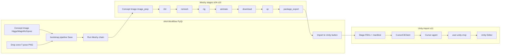
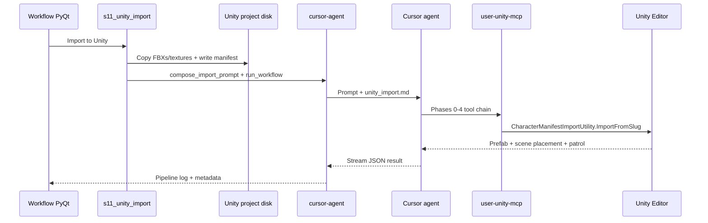

# AAA Workflow — Concept Image → Meshy → FBX → Unity MCP

A focused PyQt app for the character FBX pipeline: generate or drop an approved T-pose concept, run Meshy image-to-3D, export rigged FBX + textures, then trigger a **real Unity import** via the Cursor CLI and Unity MCP.

**In scope:** Concept Image generation (Higgsfield or Magnific Mystic), Magnific Uprez, drag-drop T-pose, Meshy chain, Unity MCP import.

**Command Center** (`launch.bat`) still provides the full prompt → concept review → Meshy path for Midjourney + multi-concept approval.

See also: [README.md](README.md) for the full AAA architecture and both GUI entry points.

---

## Quick start

```powershell
.\launch-workflow.bat
```

Or:

```powershell
.\.venv\Scripts\python.exe -m asset_assembly_automator.gui.workflow_main
```

Dry-run (no Meshy credits, fake Cursor CLI):

```powershell
.\.venv\Scripts\python.exe -m asset_assembly_automator.gui.workflow_main --dry-run
```

Entry point: `aaa-workflow` (after `pip install -e ".[dev]"`).

---

## Architecture



### Reused from main AAA app

| Component | Purpose |
|-----------|---------|
| `Database` | Same SQLite DB (`%LOCALAPPDATA%/AssetAssemblyAutomator/aaa.db`) |
| `PipelineController` / `PipelineRunner` | Async stage execution, logging, resume |
| Meshy stages `s05`–`s10` | Full Meshy chain |
| `FakeMeshyClient` | Dry-run without API credits |
| `FakeMagnificClient` / `FakeHiggsfieldClient` | Dry-run concept generate + Uprez |
| `clients/magnific_client.py` | Magnific Mystic + upscaler REST client |
| `gui/dialogs/provider_cost_dialog.py` | Cost confirmation before paid generation |

### Workflow-specific components

| File | Purpose |
|------|---------|
| `gui/workflow_main.py` | Workflow window — Concept Image UI + Meshy + Unity |
| `gui/widgets/drop_zone.py` | Drag-and-drop T-pose entry |
| `gui/widgets/character_preview_panel.py` | T-pose + mesh preview |
| `gui/widgets/pipeline_stepper.py` | `MeshyWorkflowStepper` (Concept Image → Meshy → Unity) |
| `workflow/bootstrap.py` | Drop → pipeline + tpose seed |
| `stages/s11_unity_import.py` | Stage files + Cursor CLI trigger |
| `workflow/unity_mcp_workflow.py` | Compose import/cleanup prompts + run CLI |
| `clients/cursor_cli_client.py` | Headless `cursor-agent` wrapper |
| `config/workflows/unity_import.md` | Default Unity MCP import prompt (validated tool chain) |
| `config/workflows/unity_import_cleanup.md` | Remove-from-Unity cleanup prompt |

---

## UI walkthrough

1. **Project** — select existing project or use auto-created Default Project.
2. **Character name** — slugged for output folders; **Save** commits concept or rename.
3. **Concept Image** — edit T-pose prompt template; **Use Higgs** or **Use Magnific** to generate; **Uprez** to upscale preview (Precision V2 / Creative, 2x–16x).
4. **Drop zone** — alternative: drag PNG/JPG/WEBP T-pose art directly.
5. **Preview** — generated, uprezzed, or dropped image; click **Save** to write `TPose/CHR_{slug}_TPose_Approved_v01.png`.
6. **Unity project** — path to Unity project root (saved on `projects.unity_project_path`).
7. **Poly budget** — hero / npc / crowd (Meshy API max 300k tris, 4K HD textures).
8. **Texture prompt** — optional Meshy texture prompt (used when `use_hires_texture_image` is false).
9. **Run Meshy** — cost confirmation, then Concept Image prep (auto-downscale if >2048px / 18MB) and full Meshy chain.
10. **Unity import prompt** — editable multiline text preloaded from `unity_import.md`.
11. **Import to Unity (Cursor MCP)** — runs `s11_unity_import`.
12. **Remove from Unity (Cursor MCP)** — cleanup prompt for re-test.

### Concept prompt template (default)

```
<character description here> full body T-pose, front view, orthographic character sheet,
symmetrical design, <head desc>, <outfit description, colors>, arms straight out horizontally,
legs slightly apart, clean silhouette, neutral expression, game-ready HD photo-realistic,
plain white background, no weapons, no props, no text, no watermark
```

Works well with Midjourney, Higgsfield, and Magnific Mystic.

### Magnific Uprez options

| Control | Values |
|---------|--------|
| Mode | Precision V2 (faithful, default) · Creative (prompt-guided) |
| Scale | 2x · 4x · 8x · 16x |
| Flavor | sublime · photo · photo_denoiser (Precision only) |

Configure defaults in `config/default.yaml` under `magnific:`.

---

## Meshy credit estimates

| Step | Credits (approx.) |
|------|-------------------|
| Image-to-3D | 5–30 (UI estimates ~15) |
| Remesh | 5 |
| Rig (walk + run included) | 5 |
| Custom animation (each) | 3 |

Default workflow skips custom animations.

---

## Output layout

### Character output (AAA)

```
{output_root}/Characters/{slug}/
  TPose/CHR_{name}_TPose_Approved_v01.png
  Source/Character_output.fbx
  Source/Animation_Walking_withSkin.fbx
  Source/Animation_Running_withSkin.fbx
  Animations/ANIM_{name}_custom_*.fbx
  Textures/base_color.png
  CHR_{name}_MeshyExport.zip
  pipeline_manifest.json
```

### Unity staging (s11)

```
{unity_project}/Assets/Characters/{slug}/
  Source/
  Textures/
  Animations/
  Materials/
  Prefabs/
  Controllers/
  unity_import_manifest.json
  .aaa/unity_import_{slug}.md    # prompt attachment for Cursor CLI
```

---

## Unity import model

The PyQt app **cannot** call Unity MCP directly. MCP servers in `~/.cursor/mcp.json` are only available to a Cursor agent.



### Flow (step by step)

1. **s11** copies FBX/textures into the Unity project and writes `unity_import_manifest.json` (includes `default_animator_gait: 1`, `no_scripts: false` for `CharacterOvalPatrol`).
2. **s11** composes a prompt = user guidance + auto-generated Facts block (`compose_import_prompt`).
3. **`CursorCliClient`** runs:

```text
cursor-agent -p --force --output-format stream-json --stream-partial-output [--model MODEL] "<prompt>"
```

4. The Cursor agent uses **`user-unity-mcp`** (Unity AI MCP) — not `user-unityMCP` — to execute the validated tool chain in [`config/workflows/unity_import.md`](config/workflows/unity_import.md).

### What the agent does (validated)

| Phase | MCP tools | Outcome |
|-------|-----------|---------|
| 0 Preflight | `Unity_ManageEditor` GetState, `Unity_GetConsoleLogs` | Wait for compile; baseline console |
| 1 Import | `Unity_ManageMenuItem` Execute manifest menu **or** `Unity_RunCommand` → `ImportFromSlug` | Humanoid rig, clips, controller, material, prefab |
| 2 Cleanup | `Unity_ManageGameObject` delete, `Unity_ManageAsset` Delete | Remove quick-import duplicates / `ExternalModels` |
| 3 Verify | `Unity_ListResources`, `Unity_ManageGameObject` get_components, `Unity_RunCommand` | Animator + `CharacterOvalPatrol`; clip lengths |
| 4 Play | `Unity_ManageScene` Save, `Unity_ManageEditor` Play | Oval walk on terrain |

### Unity project prerequisites (one-time)

| Asset | Role |
|-------|------|
| `Assets/Editor/CharacterManifestImportUtility.cs` | Manifest-driven import (`ImportFromSlug`) |
| `Assets/Scripts/CharacterOvalPatrol.cs` | Oval patrol; sets `Gait=1` (Walk) |

### Prerequisites (host machine)

- [Cursor CLI](https://cursor.com/docs/cli/headless) installed (`cursor-agent` on PATH)
- `cursor-agent login` or `CURSOR_API_KEY` set
- **`user-unity-mcp`** configured and connected in Cursor MCP settings
- **Unity Editor open** on the target project with MCP bridge active
- Unity project path set in the workflow app

### Config (`config/default.yaml`)

```yaml
cursor_cli:
  enabled: true
  command: cursor-agent
  model: ""
  extra_args: []
  timeout_seconds: 900
```

---

## Default Unity import prompt

Loaded from [`config/workflows/unity_import.md`](config/workflows/unity_import.md). Key points:

- MCP server: **`user-unity-mcp`** (Unity AI MCP)
- Import via `CharacterManifestImportUtility.ImportFromSlug` — **not** inline `SaveAndReimport` scripts (MCP blocks user-interaction dialogs)
- **Do not** use `Unity_ImportExternalModel` for rigged characters (rig-only quick import)
- Animator: `Gait` int (`0=Idle`, `1=Walk`, `2=Run`); default state **Walk**
- `CharacterOvalPatrol` attached on prefab/scene instance
- Meshy zips typically include Walk + Run only; Idle uses frozen walk pose

Cleanup prompt: [`config/workflows/unity_import_cleanup.md`](config/workflows/unity_import_cleanup.md) — used by **Remove from Unity**.

Edit the import prompt in the UI before **Import to Unity** to add project-specific rules.

---

## Limitations

- Unity MCP must be healthy in Cursor settings (`user-unity-mcp` connected; `user-unityMCP` is a separate bridge).
- Cursor CLI runs a full agent turn — requires auth and may take several minutes.
- Python does not invoke Unity MCP APIs directly; failures in the agent step require checking pipeline logs and Unity console.
- MCP connection may drop during Play mode — stop Play before further MCP calls.
- Main Command Center app does not auto-run `unity_import`; only this workflow app triggers it.

---

## Testing

```powershell
.\.venv\Scripts\python.exe -m pytest tests/test_workflow.py -q
.\.venv\Scripts\python.exe -m ruff check asset_assembly_automator tests
```

---

## Related docs

- [`README.md`](README.md) — full AAA PyQt app overview with architecture diagrams
- [`ASSET-ASSEMBLY-AUTOMATOR.md`](ASSET-ASSEMBLY-AUTOMATOR.md) — full product spec
- [`AGENTS.md`](AGENTS.md) — agent guardrails and Meshy invariants
- [`config/workflows/unity_import.md`](config/workflows/unity_import.md) — Unity MCP import prompt (source of truth)
