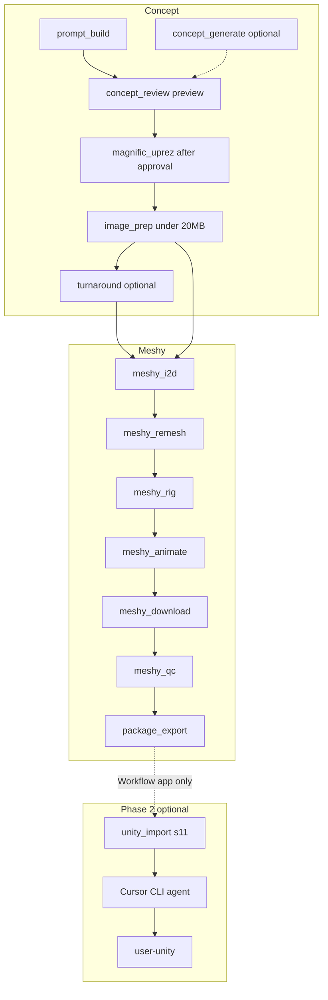

# Asset Assembly Automator (AAA)

**Version 0.2.0** — Python + PyQt6 orchestrator for Character / Vehicle / Aircraft pipelines (approved concept → optional Magnific uprez → Meshy 7 → FBX.zip → Unity).

Automates concept intake from **Midjourney, Magnific, or optional Higgsfield** (any approved PNG is fine), optional **Magnific auto-uprez**, Meshy **Quality (meshy-7 8K)** or **Game-ready (smart-topology)** presets, optional remesh (default off), rig/animate (**characters only**), QC, zip export, and **deterministic Unity import** via `com.assetassembly.import` UPM package. **AnkleBreaker MCP / agent CLI runs only when C# validation fails.** Full capability catalog: [`docs/ENHANCEMENTS.md`](docs/ENHANCEMENTS.md).

### Documentation map

| Doc | Role |
|-----|------|
| [README.md](README.md) | Developer overview — architecture diagrams, both GUIs, data model |
| [AAA-WORKFLOW.md](AAA-WORKFLOW.md) | Meshy Workflow app + Unity import chain |
| [docs/ENHANCEMENTS.md](docs/ENHANCEMENTS.md) | v0.2 locked decisions, UPM ownership, capability catalog |
| [docs/DB-TIMING.md](docs/DB-TIMING.md) | Stage timing and `pipeline_timing_stats` |
| **ASSET-ASSEMBLY-AUTOMATOR.md** (this file) | Product spec — stages, CLI, config, providers |
| [AGENTS.md](AGENTS.md) | AI agent guardrails |
| [config/workflows/unity_import_repair.md](config/workflows/unity_import_repair.md) | AnkleBreaker repair prompt (validation failure) |
| [config/workflows/unity_import_cleanup.md](config/workflows/unity_import_cleanup.md) | AnkleBreaker cleanup prompt (Remove from Unity) |
| [config/workflows/unity_import.md](config/workflows/unity_import.md) | Manual agent import reference (`unity_*` tools) |

---

## Quick start

**Command Center** (full pipeline):

```powershell
cd D:\Repos\asset-assembly-automator
python -m venv .venv
.\.venv\Scripts\pip.exe install -e ".[dev]"
.\.venv\Scripts\python.exe -m asset_assembly_automator.cli init
.\.venv\Scripts\python.exe -m asset_assembly_automator.cli create-project MyGame "D:\Output"
.\.venv\Scripts\python.exe -m asset_assembly_automator.cli create-pipeline 1 HeroCourier --poly-budget hero
.\.venv\Scripts\python.exe -m asset_assembly_automator.cli run --pipeline-id 1 --dry-run
.\launch.bat
```

**Meshy Workflow** (T-pose drop → Meshy → Unity import): `.\launch-workflow.bat` or `aaa-workflow`

Set Meshy API key via GUI **Settings** or `%USERPROFILE%\.asset_assembly_automator\secrets.env`:

```
MESHY_API_KEY=your_key_here
```

### Required for Unity import (`s11`)

| Dependency | Notes |
|------------|-------|
| **Unity 6 Editor** | Target project open while import runs |
| **Unity MCP** (one bridge) | Default **AnkleBreaker** `unity` / **user-unity**; Coplay/Official fallbacks in Settings |
| **Agent CLI** | `cursor-agent` or Claude CLI (Settings) |

See [`mcp.json.example`](mcp.json.example) and **Settings → Unity MCP bridge**. Workflow prompts default to AnkleBreaker `unity_*` tools with fallback tool mapping appended.

---

## Architecture



### Components

| Layer | Path | Role |
|-------|------|------|
| Core | `core/` | Config, logging, secrets, state machine, SQLite |
| Clients | `clients/` | Meshy, Higgsfield, Cursor CLI, animation catalog, image prep |
| Stages | `stages/s01_*` … `s11_*` | Standalone async stage scripts |
| Orchestrator | `orchestrator/` | Runner, resume, watchdog watchers |
| Workflow | `workflow/` | Bootstrap, Unity MCP prompt compose/run, templates |
| GUI | `gui/` | Command Center (`main.py`) + Meshy Workflow (`workflow_main.py`) |
| CLI | `cli.py` | `aaa` commands |

### State & resume

- SQLite DB: `%LOCALAPPDATA%\AssetAssemblyAutomator\aaa.db`
- Pipeline `current_stage` + `external_jobs.task_id` enable resume after crash
- `orchestrator/resume.py` finds active pipelines mid-Meshy and checks job expiry

---

## Pipeline stages

| Stage | CLI module | Manual gate? | Notes |
|-------|------------|--------------|-------|
| `prompt_build` | `s01_prompt_build` | No | Renders MJ/HF/Meshy prompts from YAML templates. Next stop is **preview** (`concept_review`), not Higgs/Magnific. |
| `concept_generate` | `s02_concept_generate` | No | **Optional** Higgsfield MCP/REST (Refine / Use Higgs). Skip when using Midjourney import or manual PNG at review |
| `concept_review` | `s03_concept_review` | **Yes** | Preview native concepts, then approve → Magnific uprez |
| `magnific_uprez` | `s04c_magnific_uprez` | No | Auto Magnific upscale **after** concept approval (skippable) |
| `image_prep` | `s04_image_prep` | No | T-pose checklist, crop, Python resize to Meshy **20 MB** / px cap |
| `turnaround` | `s04b_turnaround` | No | Opt-in multi-view for `multi-image-to-3d` |
| `meshy_i2d` | `s05_meshy_image_to_3d` | No | t-pose, quad, PBR, FBX+GLB |
| `meshy_remesh` | `s06_meshy_remesh` | No | Remesh to budget (default max 300k tris; skipped if i2d already within target) |
| `meshy_rig` | `s07_meshy_rig` | No | Includes free walk + run FBXs |
| `meshy_animate` | `s08_meshy_animate` | No | Custom clips from catalog (3 credits each) |
| `meshy_download` | `s09_meshy_download` | No | Downloads rig + clips + textures |
| `meshy_qc` | `s09b_qc_validate` | No | Polycount / file presence gate |
| `package_export` | `s10_package_export` | No | FBX.zip + `pipeline_manifest.json` |
| `unity_import` | `s11_unity_import` | No | UPM package + C# watcher; agent repair on validation failure only |

Run a single stage:

```powershell
.venv\Scripts\python.exe -m asset_assembly_automator.stages.s05_meshy_image_to_3d --pipeline-id 1 --dry-run
```

---

## CLI reference

| Command | Description |
|---------|-------------|
| `aaa init` | Create app data dir + SQLite schema |
| `aaa create-project NAME OUTPUT_ROOT [--unity PATH]` | New project |
| `aaa create-pipeline PROJECT_ID ASSET_NAME [--poly-budget hero\|npc\|crowd] [--multi-view]` | New character pipeline |
| `aaa run --pipeline-id N [--stage STAGE] [--dry-run] [--verbose] [--manual]` | Run pipeline or one stage |
| `aaa watch [--pipeline-id N] [--output-dir PATH] [--duration SEC]` | Watch MJ import folder |

Entry points (after install): `aaa`, `aaa-gui`, `aaa-workflow`, `asset-assembly-automator`, `asset-assembly-automator-gui`.

---

## GUI

Two windows share `PipelineController`, SQLite, and stage modules:

| App | Launch | Scope |
|-----|--------|-------|
| **Command Center** | `launch.bat` / `aaa-gui` | Full pipeline: prompts, concept, Meshy, export |
| **Meshy Workflow** | `launch-workflow.bat` / `aaa-workflow` | T-pose drop → Meshy → Unity MCP import |

### Command Center (`gui/main.py`)

- **Dashboard**: pipeline cards, run controls, stepper
- **Focused wizard**: step list via toolbar **Focused Mode**
- **Prompt builder**, **concept compare**, **animation picker**, **log tail**
- **Phase 2 stub** view for world / Unity placeholders
- **Settings**: Meshy key, MJ watch folder, theme, onboarding toggles
- **Getting Started** / **What's New** markdown dialogs

### Meshy Workflow (`gui/workflow_main.py`)

- Drag-and-drop T-pose **drop zone** → bootstrap pipeline
- **MeshyWorkflowStepper** (Meshy stages + Unity import)
- Editable Unity import prompt (from `config/workflows/unity_import.md`)
- **Import to Unity** / **Remove from Unity** via Cursor CLI

Async: qasync event loop + `PipelineController` schedules `asyncio.Task` per pipeline run.

---

## Configuration

Layered config (`core/config.py`):

1. `config/default.yaml` (repo)
2. `%USERPROFILE%\.asset_assembly_automator\config.yaml` (user override)
3. Environment variables with `AAA_` prefix

Key Meshy settings:

```yaml
meshy:
  hd_texture: true          # 4K base color (meshy-6 / latest)
  model_type: standard
  i2d_target_polycount:
    hero: 300000
    npc: 300000
    crowd: 300000
  remesh_target_tris:
    hero: 300000
    npc: 300000
    crowd: 300000
  hard_rig_face_limit: 300000
  animation_fps: 30
```

Cursor CLI (Unity import):

```yaml
cursor_cli:
  enabled: true
  command: cursor-agent
  timeout_seconds: 900
```

Prompt templates: `config/prompt_templates/*.yaml`  
Unity workflows: `config/workflows/unity_import.md`, `unity_import_cleanup.md`

---

## Output layout

```
{output_root}/Characters/{slug}/
  Concept/
  TPose/
  Source/          # Character_output.fbx, Animation_Walking/Running_withSkin.fbx
  Animations/      # walk, run, custom clips
  Textures/
  CHR_{name}_MeshyExport.zip    # or legacy CHR_{name}_UnityImport_v01.zip
  pipeline_manifest.json
```

Meshy does **not** export one merged animated FBX. The zip contains separate rig + clip FBXs for Unity Humanoid setup. Import runs via `s11` C# watcher + optional AnkleBreaker agent repair (see [AAA-WORKFLOW.md](AAA-WORKFLOW.md)).

---

## Animation defaults

Synced from `https://api.meshy.ai/web/public/animations/resources`:

- Walking (free with rig)
- Running (free with rig)
- Casual Walk (custom, resolved by catalog search)

Cache: `%LOCALAPPDATA%\AssetAssemblyAutomator\animation_catalog.json`

---

## Testing

```powershell
.venv\Scripts\python.exe -m pytest -q
.venv\Scripts\python.exe -m ruff check asset_assembly_automator tests
```

Offline tests use `FakeMeshyClient` / `FakeHiggsfieldClient` / `FakeCursorCliClient` — no API spend.

---

## Packaging (Windows)

```powershell
.\packaging\build.ps1
```

Produces `dist/AssetAssemblyAutomator/` one-folder PyInstaller build.

---

## Phase 2

| Feature | Status |
|---------|--------|
| `unity_import` (`s11`) | **Implemented** — C# UPM import + AnkleBreaker repair on failure; Workflow app; not auto-run from Command Center |
| `world_concept`, `world_i2d`, `world_remesh`, `world_export` | Schema + GUI stub only |
| Blender + Auto-Rig Pro | `clients/blender_arp_client.py` fallback rig — not wired to runner |

World pipeline creation in Command Center shows an informational dialog — not runnable in v1.

---

## MCP / API matrix (summary)

See `midjourney_meshy_unity_mcp_character_workflow.md` for the full proven workflow.

| Provider | Capability |
|----------|------------|
| **Meshy** *(required for 3D)* | Full REST pipeline (i2d, remesh, rig, animate, download) |
| **Unity 6 + Unity MCP** *(required for import)* | Editor + one bridge; default AnkleBreaker; Coplay/Official fallbacks |
| Midjourney *(optional)* | Manual + watch folder import |
| Magnific *(optional)* | Mystic generate + upscaler (workflow + auto stage) |
| Higgsfield *(optional)* | `generate_image` via MCP/REST — Command Center `concept_generate` / Workflow **Use Higgs** |

**Unity MCP:** Default **AnkleBreaker** (`unity` / user-unity). Fallbacks: **Coplay** (`user-unityMCP`), **Official** (`user-unity-mcp`) — Settings → Unity MCP bridge or `unity_mcp.bridge` in config. Prompts: [`unity_import_repair.md`](config/workflows/unity_import_repair.md), [`unity_import_cleanup.md`](config/workflows/unity_import_cleanup.md), [`unity_import.md`](config/workflows/unity_import.md).

---

## Agent guardrails

See [AGENTS.md](AGENTS.md) for contributor rules, threading invariants, and provider anti-assumptions.
