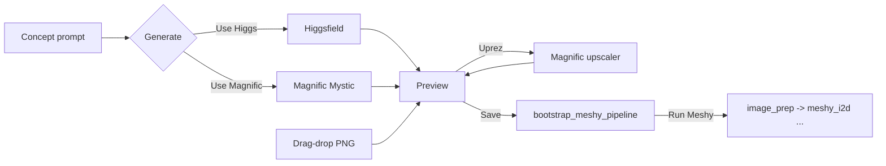
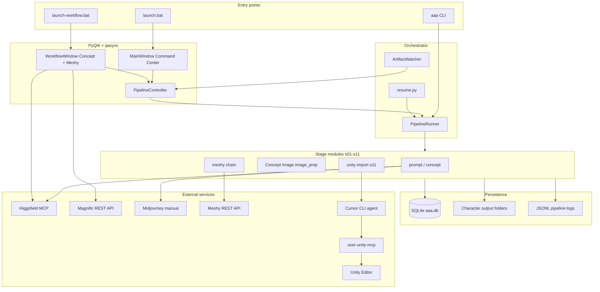
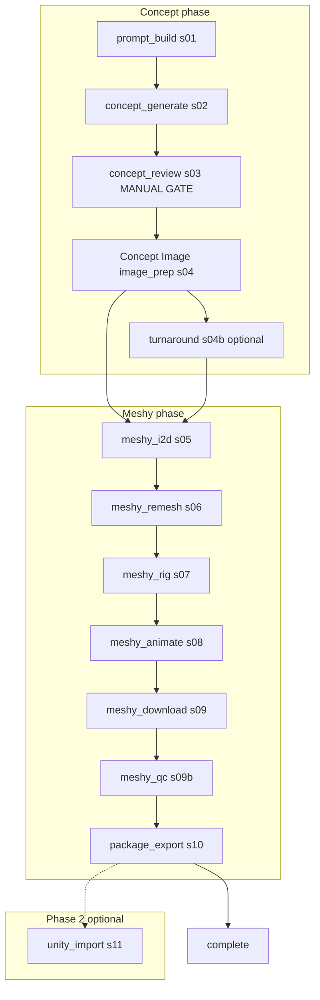
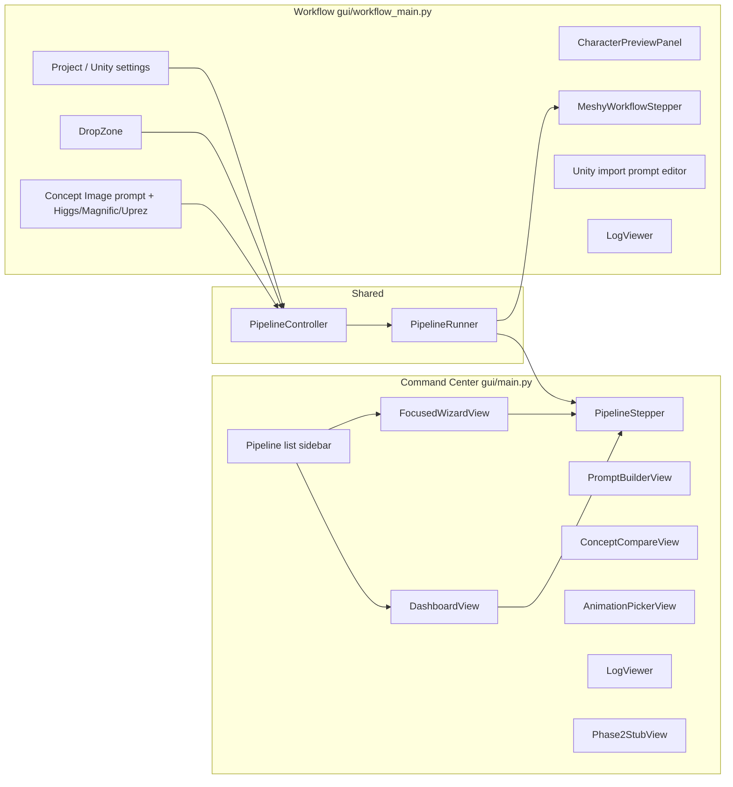
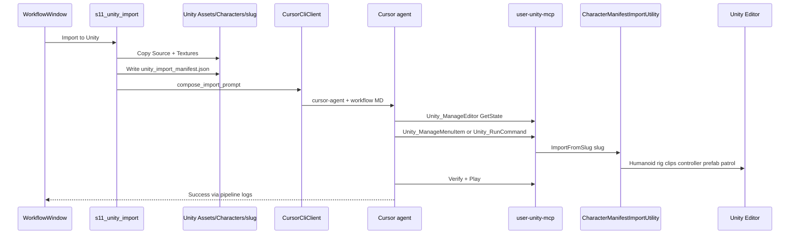
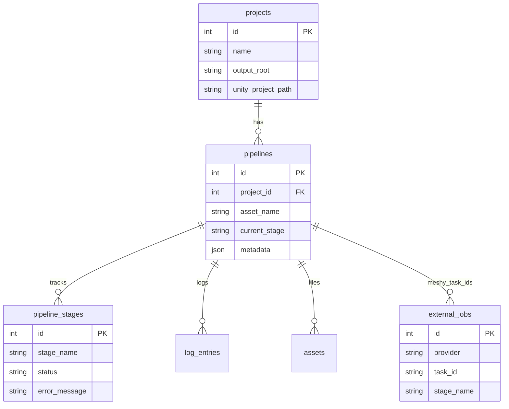
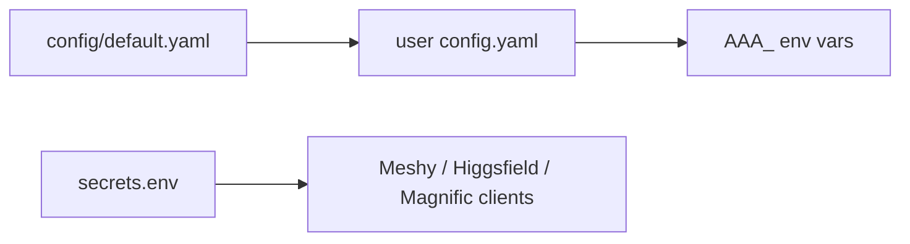

# Asset Assembly Automator (AAA)

**Version 0.1.0** — Python + PyQt6 orchestrator for the character asset pipeline: concept art (Higgsfield / Magnific / Midjourney) → Meshy image-to-3D → rig + animations → FBX.zip → optional Unity MCP import.

Two GUI entry points share the same SQLite database, stage modules, and provider clients:

| App | Launch | Scope |
|-----|--------|-------|
| **Command Center** | `.\launch.bat` or `aaa-gui` | Full pipeline: prompts, concept review, Meshy, export |
| **Meshy Workflow** | `.\launch-workflow.bat` or `aaa-workflow` | **Concept Image** (generate or drop T-pose) → Meshy → Unity MCP import |

---

## Quick start

```powershell
cd D:\Repos\asset-assembly-automator
python -m venv .venv
.\.venv\Scripts\pip.exe install -e ".[dev]"
.\.venv\Scripts\python.exe -m asset_assembly_automator.cli init
.\launch-workflow.bat
```

Copy [`secrets.env.example`](secrets.env.example) to `%USERPROFILE%\.asset_assembly_automator\secrets.env` and fill in keys:

```env
MESHY_API_KEY=your_key_here
MAGNIFIC_API_KEY=your_key_here
HF_MCP_ACCESS_TOKEN=optional_for_higgsfield_mcp
```

Legacy fallback: repo-root `meshy-api.key` / `magnific-api.key` (gitignored — **do not commit**).

---

## Meshy Workflow — Concept Image (new)

The workflow app now supports **in-app concept generation** before Meshy, in addition to drag-and-drop:

1. Select or create a **project** and **character name**.
2. Edit the **Concept Image** prompt (prefilled T-pose character-sheet template).
3. Click **Use Higgs** or **Use Magnific** to generate a concept (cost confirmation; skipped in dry-run).
4. Optionally click **Uprez** with Magnific (Mode: Precision V2 / Creative; Scale: 2x–16x; Flavor for Precision).
5. Preview the result → **Save** (writes `TPose/CHR_{slug}_TPose_Approved_v01.png`) → **Run Meshy**.



The first pipeline step displays **Concept Image** (DB stage id remains `image_prep`).

**Dry-run:** `.\.venv\Scripts\python.exe -m asset_assembly_automator.gui.workflow_main --dry-run` uses fake clients — no API credits.

---

## System overview



---

## Full character pipeline



**Manual gate (Command Center):** `concept_review` stops auto-run until the user approves a concept image in the GUI.

**Meshy Workflow app** can start at **Concept Image** (`image_prep`) after Save, or from `draft` with generate/drop → Save. Runs through `unity_import` when configured.

---

## PyQt GUI architecture



### Command Center views

| View | File | Purpose |
|------|------|---------|
| Dashboard | `views/dashboard_view.py` | Pipeline cards, run controls, status |
| Focused wizard | `views/focused_wizard_view.py` | Step-by-step alternate layout |
| Prompt builder | `views/prompt_builder_view.py` | MJ / HF / Meshy prompt templates |
| Concept compare | `views/concept_compare_view.py` | Side-by-side concept approval |
| Animation picker | `views/animation_picker_view.py` | Meshy custom clip catalog |
| Log viewer | `views/log_viewer.py` | Filterable pipeline log tail |
| Phase 2 stub | `views/phase2_stub_view.py` | World / Unity placeholders |

### Meshy Workflow window

| Widget / section | Purpose |
|------------------|---------|
| **Concept Image** | Prompt textarea + **Use Higgs** / **Use Magnific** / **Uprez** (Mode, Scale, Flavor dropdowns) |
| `DropZone` | Drag T-pose PNG/JPG/WEBP (alternative to generation) |
| `CharacterPreviewPanel` | T-pose preview + post-i2d mesh preview |
| `MeshyWorkflowStepper` | Concept Image → Meshy stages → Unity import |
| Unity prompt editor | Editable `unity_import.md` override per pipeline |
| `ProviderCostConfirmDialog` | Credit/cost estimate before Higgs/Magnific/Uprez |

Async model: **qasync** bridges Qt events and `asyncio`; concept generation uses `loop.create_task()`; Meshy runs via `PipelineController.schedule_meshy_workflow()`.

---

## Meshy image size limits (Concept Image → i2d)

Large 4K concept PNGs can exceed Meshy's practical upload limits (~20 MB in Workspace UI; API allows up to 100 MB). The client also base64-encodes images (~37% size inflation).

Stage `image_prep` (Concept Image) automatically:

1. Crops with padding (`crop_with_padding`)
2. Downscales when needed (`downscale_to_budget`) to configured limits (default **2048 px** long side, **18 MB** file size)
3. Stores hi-res cropped source in `metadata.hires_texture_path` when downscaled

Optional: set `meshy.use_hires_texture_image: true` in user config to pass the hi-res image as Meshy `texture_image_url` (mutually exclusive with `texture_prompt`).

---

## Unity import chain (Phase 2)

Python stages files; a Cursor agent drives Unity MCP.



Validated MCP tools: see [`config/workflows/unity_import.md`](config/workflows/unity_import.md).

**Avoid:** `Unity_ImportExternalModel` (rig-only), inline `SaveAndReimport` via `Unity_RunCommand` (blocked by MCP user-interaction guard).

---

## Data model and persistence



| Location | Contents |
|----------|----------|
| `%LOCALAPPDATA%/AssetAssemblyAutomator/aaa.db` | Pipelines, stages, logs, external job IDs |
| `{output_root}/Characters/{slug}/logs/{pipeline_id}/pipeline.jsonl` | Unified per-pipeline JSONL |
| `%USERPROFILE%\.asset_assembly_automator\config.yaml` | User config override |
| `%USERPROFILE%\.asset_assembly_automator\secrets.env` | API keys (see `secrets.env.example`) |

---

## Package layout

```
asset_assembly_automator/
├── cli.py                 # aaa CLI entry
├── core/                  # config, db, logging, state_machine, secrets
├── clients/               # meshy, higgsfield, magnific, cursor_cli, image_prep
├── stages/                # s01 … s11 async stage modules
├── orchestrator/          # runner, resume, watchers
├── workflow/              # bootstrap, unity_mcp_workflow, templates
└── gui/
    ├── main.py            # Command Center
    ├── workflow_main.py   # Meshy Workflow (Concept Image + Meshy + Unity)
    ├── controller.py      # PipelineController signals + tasks
    ├── views/             # dashboard, wizard, concept, logs, …
    ├── widgets/           # drop_zone, pipeline_stepper, character_preview_panel, …
    ├── dialogs/           # settings, meshy_cost, provider_cost, new pipeline
    └── theme/             # dark.qss, status colors

config/
├── default.yaml           # meshy, magnific, higgsfield defaults
├── prompt_templates/
└── workflows/
    ├── unity_import.md
    └── unity_import_cleanup.md

secrets.env.example        # Template for API keys (copy to user profile)
```

---

## CLI reference

```powershell
.\.venv\Scripts\python.exe -m asset_assembly_automator.cli init
.\.venv\Scripts\python.exe -m asset_assembly_automator.cli create-project MyGame "D:\Output" --unity "C:\Unity\MyProject"
.\.venv\Scripts\python.exe -m asset_assembly_automator.cli create-pipeline 1 HeroCourier --poly-budget hero
.\.venv\Scripts\python.exe -m asset_assembly_automator.cli run --pipeline-id 1 --dry-run
.\.venv\Scripts\python.exe -m asset_assembly_automator.cli run --pipeline-id 1 --stage meshy_i2d
```

| Entry point | Module |
|-------------|--------|
| `aaa` / `asset-assembly-automator` | `cli.py` |
| `aaa-gui` / `asset-assembly-automator-gui` | `gui.main` |
| `aaa-workflow` | `gui.workflow_main` |

---

## Configuration layers



### Key settings (`config/default.yaml`)

| Section | Notable keys |
|---------|----------------|
| **meshy** | Poly budgets (300k default), HD textures, `i2d_max_image_px` (2048), `i2d_max_image_mb` (18), `use_hires_texture_image` (false) |
| **magnific** | `mystic_model` (super_real), `resolution` (2k), `aspect_ratio` (portrait_2_3), upscale mode/scale/flavor |
| **higgsfield** | `provider` (mcp), `default_image_model` (soul_2), aspect ratio 2:3 |
| **cursor_cli** | `command`, `timeout_seconds`, optional `model` |

Override in `%USERPROFILE%\.asset_assembly_automator\config.yaml`.

---

## Provider matrix

| Provider | Integration | Capability |
|----------|-------------|------------|
| **Higgsfield** | MCP adapter (`McpHiggsfieldAdapter`) or REST | `generate_image` for concept (workflow + Command Center) |
| **Magnific** | REST client (`MagnificClient`) | Mystic text-to-image; Creative + Precision V2 upscaler (workflow **Uprez**) |
| **Midjourney** | Manual + watch-folder import | No API — user generates, watcher imports (Command Center) |
| **Meshy** | REST client + MCP server | i2d, remesh, rig, animate, download |
| **Unity** | Cursor CLI → `user-unity-mcp` | Manifest import via workflow app only |
| **Blender ARP** | Stub client | Phase 2 fallback rig |

Meshy exports **separate** rig + per-clip FBXs (not one merged animated FBX). Walk/run are free with rig; custom clips cost 3 credits each.

### Magnific API (workflow app)

| Endpoint | Use |
|----------|-----|
| `POST /v1/ai/mystic` | Text-to-image (Use Magnific) |
| `POST /v1/ai/image-upscaler-precision-v2` | Faithful upscale (Uprez default) |
| `POST /v1/ai/image-upscaler` | Prompt-guided creative upscale |

Auth header: `x-magnific-api-key`. Tasks are async — client polls until `COMPLETED`.

---

## Output layout

```
{output_root}/Characters/{slug}/
  Concept/                 # Generated concepts (Higgs/Magnific staging)
  TPose/
    CHR_{name}_TPose_Approved_v01.png
    *_prepped.png          # Downscaled for Meshy i2d when needed
  Source/
    Character_output.fbx
    Animation_Walking_withSkin.fbx
    Animation_Running_withSkin.fbx
  Animations/
  Textures/
    base_color.png
  Previews/                # Meshy i2d thumbnail / GLB preview
  CHR_{name}_MeshyExport.zip
  pipeline_manifest.json
  logs/{pipeline_id}/pipeline.jsonl
```

Unity staging (`s11`):

```
{unity_project}/Assets/Characters/{slug}/
  Source/  Textures/  Animations/  Materials/  Prefabs/  Controllers/
  unity_import_manifest.json
```

---

## Development

```powershell
.\.venv\Scripts\pip.exe install -e ".[dev]"
.\.venv\Scripts\python.exe -m pytest -q
.\.venv\Scripts\python.exe -m ruff check asset_assembly_automator tests
.\packaging\build.ps1   # PyInstaller one-folder build
```

Dry-run uses `FakeMeshyClient` / `FakeHiggsfieldClient` / `FakeMagnificClient` / `FakeCursorCliClient` — no API credits.

---

## Publishing to GitHub

1. **Never commit API keys.** `*.key`, `secrets.env`, `.mcp.json`, `.cursor/mcp.json`, and `magnific-api.key` / `meshy-api.key` are in `.gitignore`. Use [`secrets.env.example`](secrets.env.example) and [`mcp.json.example`](mcp.json.example) as templates.
2. Copy [`secrets.env.example`](secrets.env.example) locally; rotate any keys that were ever in the repo root.
3. Initialize and push:

```powershell
git init
git add .
git status   # verify no *.key or secrets.env staged
git commit -m "Initial commit: Asset Assembly Automator"
git remote add origin https://github.com/YOUR_USER/asset-assembly-automator.git
git push -u origin main
```

4. Add a **private** GitHub repo if the project contains workflow docs with internal paths.

---

## Documentation map

| Doc | Audience |
|-----|----------|
| **README.md** (this file) | Developers — architecture, GUIs, pipelines, GitHub setup |
| [ASSET-ASSEMBLY-AUTOMATOR.md](ASSET-ASSEMBLY-AUTOMATOR.md) | Product spec and stage reference |
| [AAA-WORKFLOW.md](AAA-WORKFLOW.md) | Meshy Workflow app + Concept Image + Unity MCP import |
| [AGENTS.md](AGENTS.md) | AI agent guardrails and logging contract |
| [config/workflows/unity_import.md](config/workflows/unity_import.md) | Unity MCP import prompt (agent source of truth) |
| [midjourney_meshy_unity_mcp_character_workflow.md](midjourney_meshy_unity_mcp_character_workflow.md) | End-to-end proven workflow notes |

---

## Phase 2 boundaries

| Feature | Status |
|---------|--------|
| `unity_import` (s11) | Runnable from Workflow app via Cursor CLI |
| Concept Image (Magnific/Higgs in workflow) | **Implemented** in `workflow_main.py` |
| World pipeline stages | Schema + GUI stub only |
| Blender + Auto-Rig Pro | Client stub; not wired to runner |
| Main app auto Unity import | Not triggered — use Workflow app |

---

## License and version

`asset-assembly-automator` v0.1.0, Python ≥ 3.11, Windows-first (PowerShell launch scripts). See [`pyproject.toml`](pyproject.toml) for package metadata.

Licensed under the [MIT License](LICENSE). Contributions welcome — see [CONTRIBUTING.md](CONTRIBUTING.md).
