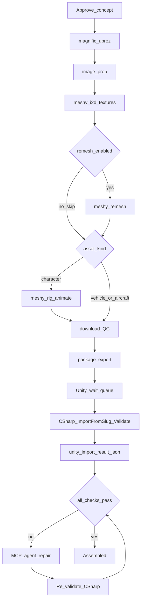
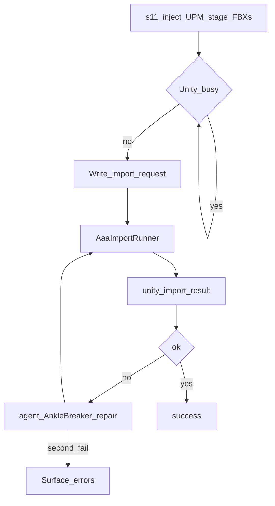

# AAA Enhancements — Character / Vehicle / Aircraft

Durable spec for the **v0.2** enhancement track. Implementation history: Cursor plan `aaa_asset_type_enhancements_dc1e776a`. Related: [DB-TIMING.md](DB-TIMING.md), [AAA-WORKFLOW.md](../AAA-WORKFLOW.md), [ASSET-ASSEMBLY-AUTOMATOR.md](../ASSET-ASSEMBLY-AUTOMATOR.md).

---

## Status (v0.2.0)

**Legend:** ✅ **Complete** · 🔄 **In queue** · ⏸ **Deferred** (Phase 2 / out of scope)

### ✅ Complete

| Area | Delivered |
|------|-----------|
| **Asset kinds** | `character` / `vehicle` / `aircraft` on `pipelines`; branched stage graph (vehicles/aircraft skip rig/animate) |
| **Meshy presets** | Quality (`meshy-7`, 8K) vs Game-ready (`smart-topology`); GUI + config; `image_enhancement` toggle |
| **Remesh** | Optional; **default off**; skip when disabled (textures come from i2d, not remesh) |
| **Magnific** | Auto stage `magnific_uprez` **after concept approval**; Workflow **Uprez** button retained |
| **Concept intake** | Midjourney drop, Magnific, optional Higgsfield; only Meshy required for 3D |
| **Unity happy path** | UPM `com.assetassembly.import`; `import_request.json` → C# `AaaImportRunner` → `unity_import_result.json` (no agent) |
| **Unity repair** | Agent CLI (Cursor/Claude) + `unity_import_repair.md` **only on validation failure** |
| **Unity MCP** | Default **AnkleBreaker** (`unity` / user-unity); **Coplay + Official fallbacks** (Settings / `unity_mcp.bridge`) |
| **Vehicle / aircraft** | Kind-specific import utilities, `DriveController` / `FlightController` |
| **Animator controllers** | Built **in the target project** by C# (`CreateAnimatorControllerAtPath`) — not copied from elsewhere |
| **Concurrency** | Meshy + Magnific semaphores; Unity import wait-queue (`unity_imports: 1`) |
| **Logging** | `duration_ms`, `stage_id` on stage rows + logs; Log viewer duration column |
| **Tools menu** | **Logs**, **Show errors**, **Diagnostics** (Meshy / Magnific / Unity MCP ping) |
| **Timing DB** | `pipeline_stages.duration_ms`; `pipeline_timing_stats` rollup after successful import |
| **Workflow app** | Meshy Workflow: concept → Meshy → **Import to Unity** (`s11`) |
| **Unity workflows** | AnkleBreaker-aligned: `unity_import.md`, `unity_import_cleanup.md`, `unity_import_repair.md` |
| **Tests** | pytest (asset kinds, remesh skip, Unity lock, s11 dry-run, MCP bridges, timing rollup) |
| **Docs** | README, AAA-WORKFLOW, ENHANCEMENTS, DB-TIMING, Getting Started / What's New v0.2 |

### 🔄 In queue

| Item | Notes |
|------|-------|
| **Live speed baseline** | Populate speed audit with real `pipeline_timing_stats` from full Quality + Unity runs |
| **Timing UI** | Workflow/Command Center panel reading `pipeline_timing_stats` (DB ready; GUI not built) |
| **Command Center `unity_import`** | `s11` runnable from **Meshy Workflow app** only; not auto-chained from Command Center runner |
| **Provider milestone logs** | More `writer.log()` at Meshy/Higgsfield poll boundaries (AGENTS.md gaps: s01, s03, s07–s10) |
| **Meshy poll tuning** | Backoff / interval optimization after live timing data |
| **DB hygiene** | `log_entries` retention; unique active `external_jobs` — see [DB-TIMING.md](DB-TIMING.md) |
| **Phase 2 stub copy** | Command Center Phase 2 tab may still list `unity_import` as Phase 2 |
| **End-to-end live validation** | Full run: Unity 6 + AnkleBreaker + open Editor + real Meshy credits |
| **Optional XR boarding/HUD** | Dual runtime locked; XR extras only if target project has XR packages (desktop path ships) |

### ⏸ Deferred (Phase 2 / v1 out of scope)

| Item | Notes |
|------|-------|
| **World pipeline** | `world_concept`, `world_i2d`, `world_remesh`, `world_export` — schema + GUI stub only |
| **Blender MCP + Auto-Rig Pro** | `clients/blender_arp_client.py` stub; not wired to runner |
| **Parallel Unity Editors** | Serialized by design (`unity_imports: 1`) |
| **Meshy TCP bridge** | Not planned v1 |
| **Python UnityMcpClient** | Agent CLI + MCP only — no Python HTTP to Unity bridge |
| **Force remesh on every Quality job** | Remesh optional; default off |
| **WheelCollider / full vehicle sim** | Arcade `DriveController` only |
| **Agent-authored C# / controllers** | Forbidden — AAA package owns all import tooling |

---

## Goals

- **Asset kinds:** Character, Vehicle, Aircraft (Worldbuilding remains Phase 2).
- **Meshy 7 Quality** vs **Game-ready Smart Topology**; optional remesh (default off); image enhancement toggle.
- **Magnific auto-uprez** after concept approval (manual Uprez retained).
- **Predetermined C# Unity import** via UPM package; **MCP / agent only on validation failure**.
- **Parallel Meshy/Magnific**; **serialized Unity import** (wait-queue).
- **Structured logging** (`duration_ms`, task_id, skip reasons) + Tools → Logs / Diagnostics.
- **Self-contained Unity tooling** — target project receives everything it needs from AAA; no external Unity project dependency.

---

## Locked decisions

| Topic | Choice |
|-------|--------|
| Flying type | **Aircraft** (`asset_kind=aircraft`) |
| Meshy modes | **Dual presets**: Quality vs Game-ready; **image enhancement** on both |
| Remesh | Optional, default **off** — texturing is in `meshy_i2d`, not remesh |
| Unity happy path | Predetermined C# only (`ImportFromSlug` + `AssetAssemblyValidator` + result JSON) |
| Unity repair | Default **AnkleBreaker** `unity` / user-unity; Coplay + Official fallbacks via Settings / config |
| Agent hosts | **`cursor-agent`** and **Claude CLI** for **repair + Diagnostics ping only** — never on successful import |
| Unity helpers | **AAA owns the C#.** Inject UPM `com.assetassembly.import` into `{unity}/Packages/` — not loose `Assets/` copies as primary |
| Animator controllers | **Created by C# in the target project** — agent never writes controllers |
| XR Pipeline | **Reference / inspiration only** during package authoring — **not** a runtime or import dependency |
| Unity runtime | **Dual**: desktop/gamepad default; XR boarding/HUD only if the Unity project has XR packages |
| Magnific | Auto stage after approval **and** Workflow Uprez button |
| Parallel Unity | **Never** — `unity_imports: 1` wait-queue |
| Unity version | **Unity 6** Editor required for `unity_import` |
| Diagnostics | Tools → Diagnostics: Meshy key, Magnific key, Unity MCP ping (green/red; no secrets) |
| Logging | Every stage: `duration_ms`, provider `task_id`, skip/fail reason; Tools → Logs / Show errors |

---

## Ownership: AAA package vs XR Pipeline

**Verified:** AAA Unity import does **not** require any controllers, scripts, or assets from `c:\Users\EazyTom\Unity\XR Pipeline` (or any other game project).

| Layer | Owns | Notes |
|-------|------|-------|
| **AAA repo** `unity_package/com.assetassembly.import/` | Editor + Runtime C# | Source of truth; versioned with AAA |
| **s11 / `unity_helpers.py`** | Inject package into **configured** `unity_project_path` | Digest skip when unchanged; fallback `unity_templates/` if package missing |
| **Target Unity project** | Receives package under `Packages/com.assetassembly.import/`; staged FBXs/textures/manifest under `Assets/{Characters\|Vehicles\|Aircraft}/{slug}/`; **AnimatorController** assets created at import time | Destination only |
| **XR Pipeline** (or any other Unity project) | Optional **target** if `unity_project_path` points there | Never a **source** of import tooling |
| **Agent / MCP** | Repair + Diagnostics only | Must not invent import controllers or call `Unity_ImportExternalModel` for characters |

XR Pipeline may still contain its own `ShipFlightController`, cockpit HUD, `VehicleRigBuilder`, etc. Those are **project-local**. AAA ships its own `FlightController` / `DriveController` / `CharacterOvalPatrol` under namespace `AssetAssembly.Import.Runtime`.

**Do not:** couple AAA to XR Pipeline paths; ask the agent to generate import controllers; copy XR `.controller` assets into the package.

---

## Capability catalog

### Concept → 3D

| Capability | Behavior |
|------------|----------|
| Midjourney watch-folder | Manual generate + drop; concept_review gate |
| Higgsfield (optional) | Concept generation when configured |
| Magnific auto-uprez | Stage after concept approval; skippable |
| Magnific manual Uprez | Workflow button retained |
| Image prep | Downscale with Quality-aware caps (4096 px / ~18–20 MB); preserve Magnific detail |
| Meshy Quality | `meshy-7`, `texture_resolution` 2k/4k/8k (default 8k), `should_remesh=false` on i2d |
| Meshy Game-ready | `smart-topology` / `meshy-t2`, polycount slider; remesh always skip |
| Image enhancement | Toggle on both presets (default on) |
| Remesh stage | In graph; immediate skip when disabled; Quality-only when enabled |
| Character branch | Optional remesh → rig → animate (Idle3/4/12 + Walk/Run from Meshy) |
| Vehicle / Aircraft branch | Skip rig/animate; FBX + textures only |
| Download / QC / zip | Kind-aware QC; Unity-ready package export |

### Unity import

| Capability | Behavior |
|------------|----------|
| UPM inject | Sync `com.assetassembly.import` → `Packages/` |
| Staging | Copy Source/Animations/Textures + `unity_import_manifest.json` |
| Trigger | Write `{slug}/.aaa/import_request.json` |
| Editor runner | `AaaImportRunner` (`[InitializeOnLoad]`) waits for compile, runs import + validate |
| Character import | Humanoid, clips, **programmatic** animator SM, material/PBR, prefab, patrol |
| Vehicle import | Generic FBX + HD PBR + `DriveController` |
| Aircraft import | Generic FBX + HD PBR + `FlightController` |
| HD textures | `MeshyHdImportUtility` — 8K-aware importer, metal/rough pack |
| Validate | `AssetAssemblyValidator` → `unity_import_result.json` |
| Python poll | `unity_import_poll` until result or timeout |
| Repair | Agent + `unity_import_repair.md` once; re-validate; then fail |
| Cleanup | Agent + `unity_import_cleanup.md` (Remove from Unity) |
| Manual agent import | `unity_import.md` for Workflow prompt editor / fallback when C# path unavailable |
| Wait-queue | Second pipeline logs `queued_unity_import` until lock free |
| Unity menus | `Tools/AAA/Import from manifest...`, `Tools/AAA/Validate assembled asset...` (package) |

### Ops / GUI

| Capability | Behavior |
|------------|----------|
| Diagnostics | Meshy / Magnific / Unity MCP health (no key display) |
| Logs | Tools → Logs; Show errors; duration column |
| Timing rollup | `pipeline_timing_stats` after successful `unity_import` |
| Parallel Meshy | Semaphore (`meshy.max_concurrent_jobs`) |
| Agent provider | Cursor CLI \| Claude CLI (repair/ping) |
| MCP bridge select | Settings → Unity MCP bridge / `unity_mcp.bridge` |

---

## Target pipeline flow

### Per-kind outputs

| Kind | Meshy | Unity folder | Runtime | Animator |
|------|-------|--------------|---------|----------|
| Character | i2d → optional remesh → rig → animate | `Assets/Characters/{slug}/` | `CharacterOvalPatrol` | Built by `CharacterManifestImportUtility` (Idle3/4/12, Walk, Run; `Gait` + `IdleIndex`) |
| Vehicle | i2d → optional remesh | `Assets/Vehicles/{slug}/` | `DriveController` | N/A (generic) |
| Aircraft | i2d → optional remesh | `Assets/Aircraft/{slug}/` | `FlightController` | N/A (generic) |

Prefixes: `CHR_` / `VEH_` / `AIR_`. Vehicles/aircraft use `Approved/` (not `TPose/`).

### Validator success criteria (by kind)

| Kind | Must pass |
|------|-----------|
| **Character** | Humanoid avatar; Idle3/Idle4/Idle12 + Walk + Run; default idle; base color size ≥ requested (8192 for 8k); metallic/smoothness + normal when expected; prefab present |
| **Vehicle** | Generic rig; HD PBR; `DriveController` on root; prefab present |
| **Aircraft** | Generic rig; HD PBR; `FlightController`; XR seat `skipped` is pass if no XR packages |

---

## Unity package inventory (`com.assetassembly.import`)

Source: [`unity_package/com.assetassembly.import/`](../unity_package/com.assetassembly.import/). Injected by [`ensure_unity_import_package()`](../asset_assembly_automator/workflow/unity_helpers.py).

| Path | Role |
|------|------|
| `package.json` | UPM identity `com.assetassembly.import` v0.2.0 |
| `Editor/AaaImportRunner.cs` | Watcher: `import_request.json` → Import + Validate → `unity_import_result.json` |
| `Editor/CharacterManifestImportUtility.cs` | Humanoid import; **creates** `{slug}_Controller.controller` |
| `Editor/VehicleManifestImportUtility.cs` | Vehicle import + `DriveController` |
| `Editor/AircraftManifestImportUtility.cs` | Aircraft import + `FlightController` |
| `Editor/MeshyHdImportUtility.cs` | 8K / PBR texture import helpers |
| `Editor/AssetAssemblyValidator.cs` | Post-import checks → result JSON |
| `Runtime/CharacterOvalPatrol.cs` | Idle cycle + oval walk |
| `Runtime/DriveController.cs` | Arcade drive (desktop input) |
| `Runtime/FlightController.cs` | Arcade fly/hover (desktop input) |

Legacy fallback (if package source missing): copy from [`unity_templates/`](../unity_templates/) into `Assets/AAA.Import/` — still AAA-owned, not XR Pipeline.

### What appears in the target project after a successful character import

Created/updated **in the target Unity project** (not pre-shipped from XR Pipeline):

- Staged FBXs / textures under `Assets/Characters/{slug}/`
- `unity_import_manifest.json`
- `{slug}_Controller.controller` (programmatic state machine)
- Extracted `.anim` clips, `MAT_{slug}_Body.mat`, `PF_{slug}.prefab`
- Scene instance with Animator + `CharacterOvalPatrol`
- `.aaa/import_request.json` (consumed) and `.aaa/unity_import_result.json`

---

## Unity import flow (happy path + repair)

1. Python injects UPM package, stages FBX/textures/manifest, **acquires Unity lock**.
2. Writes `{slug}/.aaa/import_request.json`.
3. Editor `AaaImportRunner` runs kind-specific `ImportFromSlug` + `AssetAssemblyValidator`.
4. Python polls `{slug}/.aaa/unity_import_result.json`.
5. **Success:** stage completes — **no cursor-agent / no MCP import**.
6. **Failure / timeout only:** agent CLI + [`config/workflows/unity_import_repair.md`](../config/workflows/unity_import_repair.md), then C# re-validate once.

### Required dependencies (Unity import)

| Item | Required |
|------|----------|
| Unity 6 Editor | Yes — project open during import |
| Unity MCP (one bridge) | Yes for **repair / cleanup / Diagnostics** — not for happy-path ImportFromSlug |
| Meshy API key | Yes — for Meshy stages before import |
| Cursor CLI or Claude CLI | Yes for repair/ping when agent path is used |

**Default bridge:** AnkleBreaker (`unity` / user-unity). Override in **Settings → Unity MCP bridge** or `unity_mcp.bridge`. See `mcp.json.example` — enable **one** Unity MCP server at a time.

AAA Python must **not** call the Unity Editor HTTP bridge (`http://127.0.0.1:7890/...`). AnkleBreaker owns that port.

### Agent / MCP boundaries

| Allowed | Forbidden |
|---------|-----------|
| Preflight / `unity_editor_ping` (Diagnostics) | Happy-path `ImportFromSlug` via MCP when C# watcher works |
| Repair after validator fail | `Unity_ImportExternalModel` for rigged characters |
| Cleanup workflow | Generating new C# controllers or improvising alternate import stacks |
| Manual `unity_import.md` when user drives agent import | Exploring other characters / editing `.meta` by hand |

---

## Meshy API notes

- **Quality:** `ai_model=meshy-7`, `texture_resolution=8k` (or 2k/4k), `should_remesh=false` on i2d. Drop deprecated `hd_texture` when `texture_resolution` is set.
- **Game-ready:** `model_type=smart-topology`, `ai_model=meshy-t2`, `target_polycount` 100–15000.
- No `remove_lighting` on meshy-7 (meshy-6 only).
- 8K costs **15** credits; PBR maps at 8K are 4K; no emission map at 8K.
- Textures: `should_texture` + `texture_resolution` on Image-to-3D — **not** remesh.
- Remesh job: topology/polycount only; optional; Game-ready always skips.

---

## Logging contract

Via `run_stage()` / `PipelineLogWriter`:

| Field | Purpose |
|-------|---------|
| `pipeline_id`, `asset_name`, `asset_kind` | Filter parallel runs |
| `stage`, `stage_id` | Join `pipeline_stages` |
| `duration_ms` | Timing |
| `provider`, `task_id` | Failed external jobs |
| `skipped` + `reason` | Remesh off, Magnific off, etc. |
| `error` / `error_code` | Failures (no secrets) |

Never log API keys or `Authorization` headers. Timing details: [DB-TIMING.md](DB-TIMING.md).

---

## Speed audit

### Pre (bottlenecks addressed)

| Bottleneck | Fix |
|------------|-----|
| Remesh polls i2d when disabled | Immediate skip when `remesh_enabled=false` |
| i2d fbx+glb | Default fbx-only for pipeline where applicable |
| 2048px downscale after Magnific | Quality cap 4096px / **20 MB hard cap** (default 18 MB) |
| s11 always cursor-agent | C# watcher; agent only on fail |
| max_concurrent_jobs unused | Provider semaphores wired |

### Post (expected)

| Path | Dominant stages |
|------|-----------------|
| Quality 8K character | i2d poll, rig, animate (3 idles), download |
| Game-ready vehicle | i2d poll, download, QC |
| Unity import (happy) | Package inject + Editor compile + C# import (**no LLM**) |

Orchestration is lean for v0.2; remaining wall time is mostly **Meshy/API poll** and **manual concept gates**.

---

## Out of scope (v1)

Worldbuilding, Blender ARP, WheelCollider sim, Meshy TCP bridge, parallel Unity Editors, Python UnityMcpClient, forcing remesh on every Quality job, pinning XR Pipeline as a shipping dependency, agent-generated import controllers.

---

## Test plan

✅ **Complete:** pytest covers payload shapes, remesh skip, asset_kind branching, Unity lock, s11 happy path (dry-run), MCP bridge selection, timing rollup (`tests/test_enhancements.py`, `test_pipeline_timing.py`, `test_workflow.py`).

🔄 **In queue:** live E2E checklist (Unity Editor open, real Meshy job, timing stats row populated) before tagging a release.

### Manual E2E checklist (live)

1. Unity 6 open on configured project; AnkleBreaker MCP connected.
2. Run Quality character through Workflow → Import to Unity (happy path: no agent).
3. Confirm `Packages/com.assetassembly.import` present; prefab + controller under `Assets/Characters/{slug}/`.
4. Confirm `unity_import_result.json` `ok: true` and `pipeline_timing_stats` row written.
5. Optionally force a validator failure and confirm one repair attempt via agent.
6. Vehicle + aircraft dry or live: `DriveController` / `FlightController` on prefab; no character animator required.
